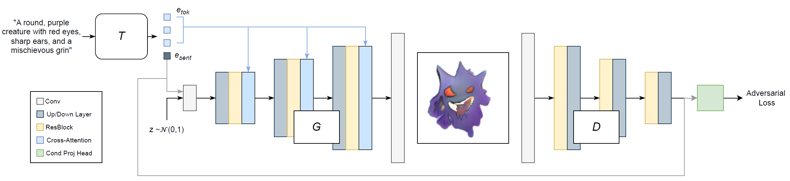
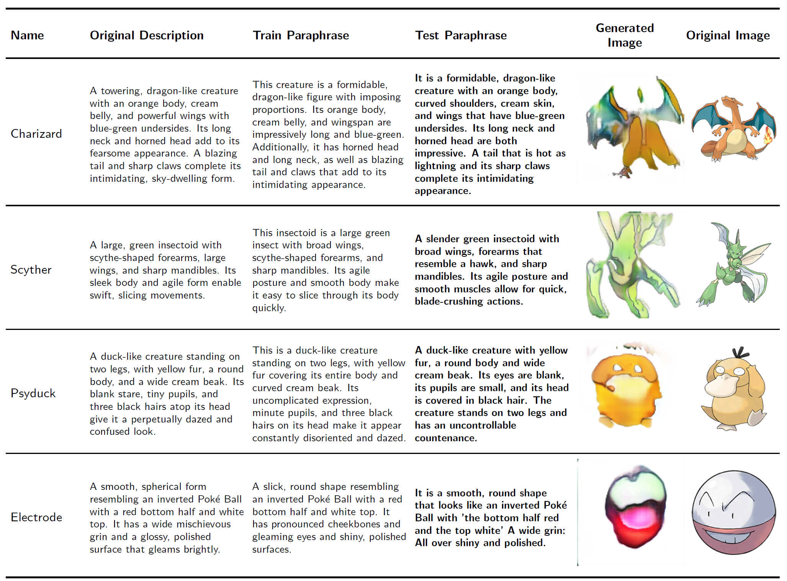
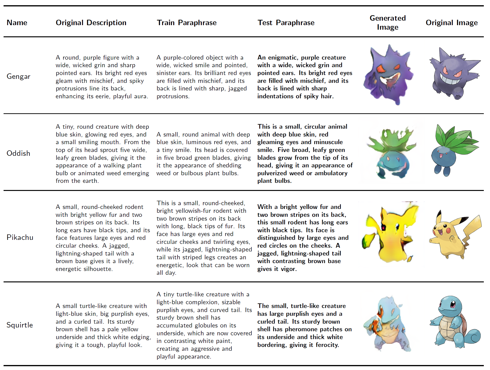
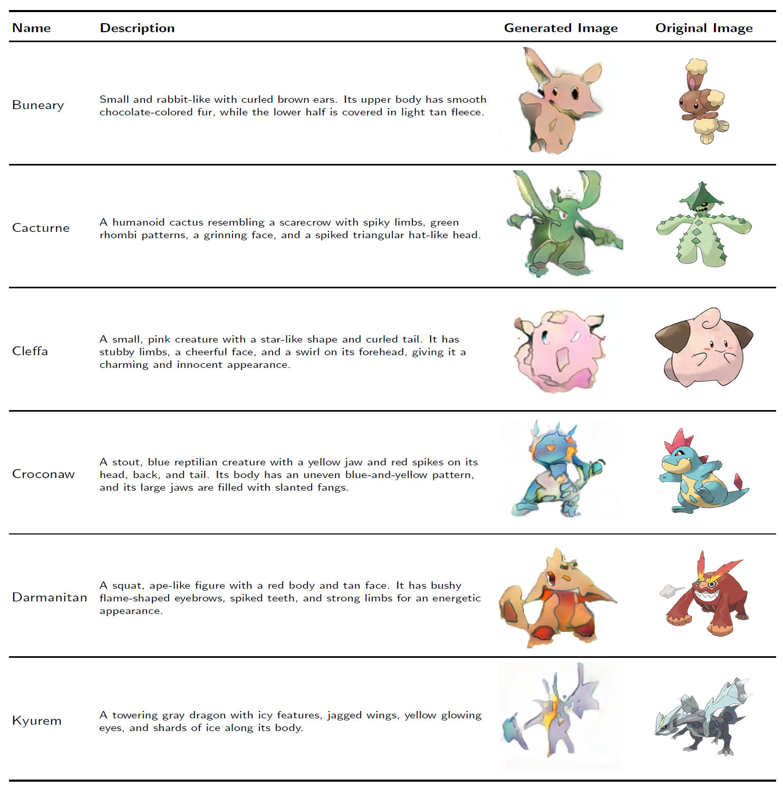

# PikaPikaGen

This repository contains the implementation of **PikaPikaGen**, a text-to-image generative model developed as part of the Deep Learning course project.

PikaPikaGen addresses the multimodal generation task of synthesizing Pokémon-style sprite images from natural language descriptions, such as those found in the Pokédex. These descriptions typically include visual traits, elemental types and behavioral cues, which serve to guide the generation process.

## Model

The proposed model follows a **conditional Generative Adversarial Network (cGAN)** paradigm and comprises three primary modules:

- **Text Encoder**: A CLIP-based transformer encodes the input Pokémon description into (i) a **global sentence embedding**, used to condition both the generator (at its input layer) and the discriminator (via the projection head), and (ii) **per-token contextualized embeddings**, injected into the generator at multiple spatial resolutions via cross-attention blocks. To adapt the pretrained CLIP model to the Pokémon domain, a selective **fine-tuning strategy** is adopted, wherein only a subset of parameters — embedding layers, final transformer block, normalization layers statistics and projection heads — are updated. This facilitates moderate domain adaptation while preserving general linguistic priors.

- **Generator**: A resolution-adaptive architecture that transforms a latent noise vector, conditioned on the textual embeddings, into a high-resolution sprite image. The generator integrates sentence-level semantics at the input level and performs fine-grained conditioning via multi-stage cross-attention over per-token embeddings. Each stage comprises (i) an upsampling layer, (ii) a residual convolutional block with Group Normalization and SiLU activation and (iii) a cross-attention block.

- **Discriminator**: A convolutional network designed to evaluate both visual fidelity and semantic alignment of generated images. It comprises a series of residual blocks with spectral normalization and progressive downsampling. Conditioning is performed via a projection head at the final stage that fuses the final visual representation with the sentence embedding to yield a scalar realism-alignment score.

The overall architecture is illustrated below:

  

Full architectural details, training procedures and ablation choices are described in the  [project report](pikapikagen_report.pdf).

## Dataset

A custom Pokémon dataset was constructed from scratch, specifically tailored to the requirements of text-to-image generation. The goal was to build a dataset that captures both the **visual diversity** of Pokémon characters and the **linguistic variability** in how they can be described. To this end, a multi-phase data pipeline was designed and implemented:

1. **Image Collection** – Retrieval of diverse, high-quality anime-style images for each Pokémon species from online sources.
2. **Image Segmentation** – Removal of backgrounds  to help the model focus solely on the character's visual features.
3. **Description Curation** – Construction of visually grounded textual descriptions emphasizing color, shape, pose and other salient traits.
4. **Paraphrasing** – Automated generation of semantically equivalent rephrasings to enhance linguistic coverage and model generalization. For each original description, two paraphrases were created:
   - One used as a **training variant** (`train_paraphrase`)
   - One reserved for **testing** (`test_paraphrase`), providing unseen input to evaluate model generalization at test time.

The final dataset consists of approximately **40 background-free images per Pokémon**, along with a structured CSV file containing:
- `name`: Pokémon name  
- `description`: Primary visual description  
- `train_paraphrase`: Alternative phrasing used during training  
- `test_paraphrase`: Held-out paraphrase for generalization testing  

Due to copyright restrictions, the dataset itself is not publicly distributed. However, the repository provides a `dataset/` folder containing utility scripts that can be used to build a similar dataset.

Multiple model variants were explored throughout development. Please refer to the accompanying project report for details.

## Results
On the **Intra-Test set**, the model effectively captures key visual features and maintains color fidelity despite paraphrased inputs. Performance naturally declines on the **Novel-Test set**, where unseen descriptions challenge generalization, resulting in simplified or blurry outputs.

Color and coarse shape are generally well preserved, but fine features are often distorted or omitted.

Qualitative results for both Intra-Test and Novel-Test scenarios are illustrated in the Figures below.

<h3>Intra-Test:</h3>

  
  

<h3>Novel-Test:</h3>

  

